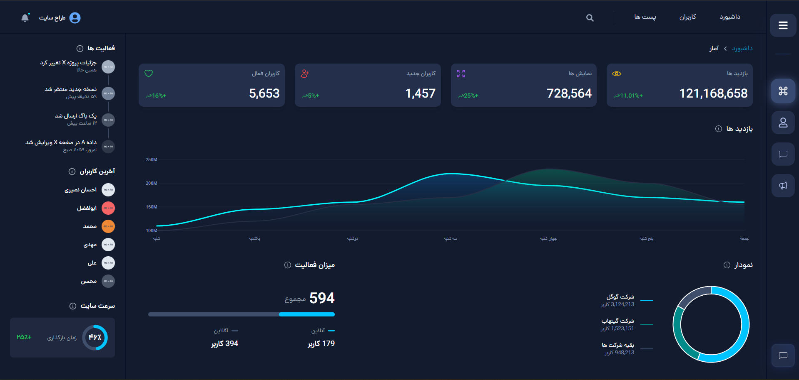
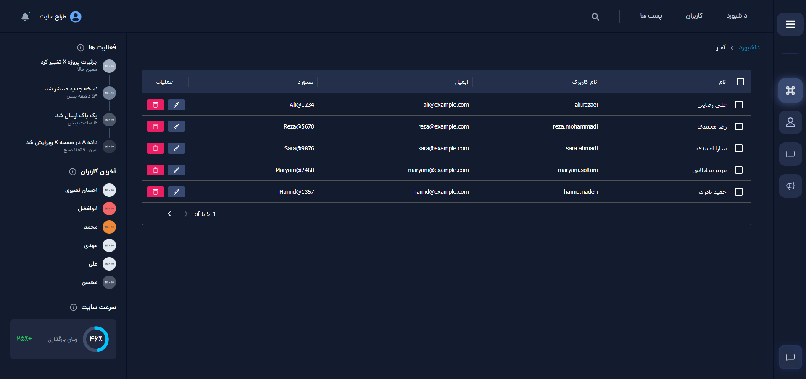
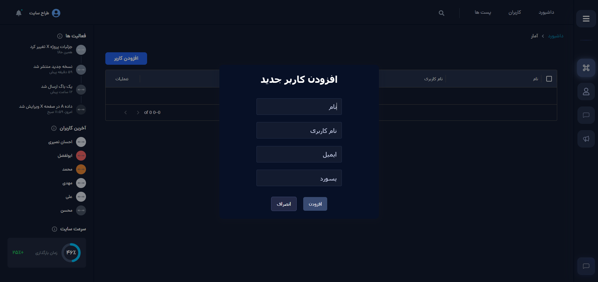
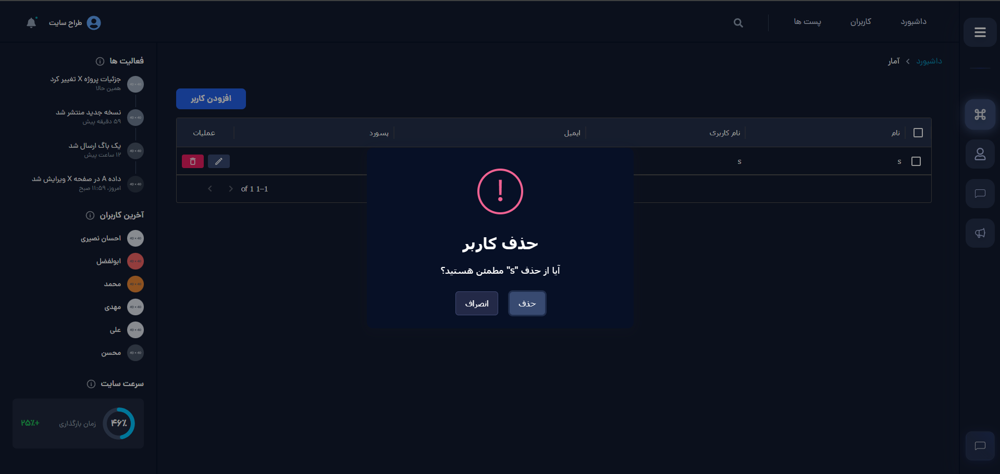
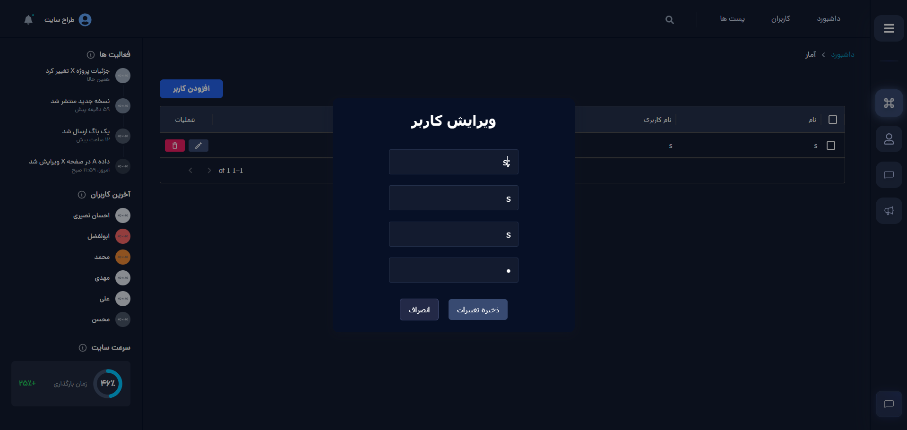

<div align="center">

  <h1>پنل مدیریت (CMS) با React + Vite</h1>

  <p>
    داشبورد مدیریتی سریع، مدرن و قابل توسعه با استفاده از React، Vite و Tailwind CSS
  </p>

  

  <p>
    <a href="https://nodejs.org/">Node</a>
    ·
    <a href="https://react.dev/">React</a>
    ·
    <a href="https://vitejs.dev/">Vite</a>
    ·
    <a href="https://tailwindcss.com/">Tailwind CSS</a>
  </p>
</div>

---
## تکنولوژی‌ها و کتابخانه‌ها

<!-- Core -->


<!-- UI Kit -->


<!-- Charts -->


<!-- UX Helpers -->


<!-- Routing -->


<!-- Dev Tools -->


## معرفی

این پروژه یک پنل مدیریت (CMS) فرانت‌اند است که با React و Vite ساخته شده و برای توسعه سریع، ساخت آسان و تجربه کاربری روان بهینه شده است. ساختار ماژولار، کامپوننت‌های تمیز و استفاده از ابزارهای مدرن باعث می‌شود بتوانید آن را به سادگی شخصی‌سازی و گسترش دهید.

## امکانات کلیدی

- داشبورد اصلی با کارت‌ها و آمارهای کلیدی
- مدیریت کاربران همراه با جدول پیشرفته
  - جستجو، فیلتر، مرتب‌سازی و صفحه‌بندی
  - انتخاب سطر و اکشن‌های سریع (قابل توسعه)
- سایدبار و ناوبری واکنش‌گرا
- نمودارها (Line/Donut) برای نمایش بینش‌های داده‌ای
- استایل‌دهی سریع با Tailwind CSS
- ساخت بسیار سریع با Vite و HMR

## پیش‌نیازها

- یکی از مدیرهای بسته: `npm`، `yarn`، `pnpm` یا `bun`

## نصب و اجرا

```bash
# نصب وابستگی‌ها (یکی را انتخاب کنید)
npm install
# yarn
# yarn
# pnpm
# pnpm install
# bun
# bun install

# اجرای محیط توسعه
npm run dev

# ساخت نسخه تولیدی
npm run build

# پیش‌نمایش نسخه تولیدی
npm run preview
```

پس از اجرای دستور توسعه، پروژه روی آدرس پیش‌فرض Vite در دسترس است (معمولاً `http://localhost:5173`).

## پشته فناوری (Tech Stack)

- React 18
- Vite
- Tailwind CSS
- ESLint (پیکربندی در `eslint.config.js`)

## ساختار پوشه‌ها

```text
my-app/
├─ public/
├─ src/
│  ├─ assets/
│  ├─ components/
│  │  ├─ Boxes/
│  │  ├─ Chart/ (شامل Donut.jsx و Chart.jsx)
│  │  ├─ Header/
│  │  ├─ Home/
│  │  ├─ LeftSidebar/
│  │  ├─ Navigator/
│  │  ├─ Sidebar/
│  │  ├─ Stats/
│  │  └─ Users & UsersTable/
│  ├─ App.jsx
│  ├─ main.jsx
│  └─ index.css
├─ vite.config.js
├─ tailwind.config.js
└─ README.md
```

## اسکریپت‌های کاربردی

```json
{
  "dev": "vite",
  "build": "vite build",
  "preview": "vite preview"
}
```

## راهنمای توسعه

- کامپوننت‌های جدید را در `src/components` بسازید و ساختار را تمیز و قابل فهم نگه دارید.
- استایل‌ها را با کلاس‌های Tailwind بنویسید و در صورت نیاز از فایل‌های CSS ماژولار استفاده کنید.
- برای جداول بزرگ، به بهینه‌سازی رندر (memoization) و مجازی‌سازی فکر کنید.
- قبل از مرج به `main`، شاخه‌ی فیچر را روی `main` ری‌بیس کنید یا PR بسازید.

## مشارکت

پیشنهادها و PRها خوش‌آمدند! برای افزودن قابلیت‌ها یا رفع باگ:

1. یک شاخه بسازید (مثلاً `feature/awesome-thing`).
2. تغییرات را به‌صورت اتمیک و تمیز کامیت کنید.
3. تست/بیلد بگیرید و سپس PR ارسال کنید.

## لایسنس

این پروژه تحت مجوز MIT منتشر می‌شود. برای اطلاعات بیشتر فایل `LICENSE` (در صورت وجود) را ببینید.

## اسکرین‌شات/دمو






اگر سوالی داشتید یا به راهنمایی نیاز دارید، یک Issue باز کنید یا پیام بگذارید. موفق باشید! 🚀
